#                    Program - Class 12

Author: Hazique sayyed

<h1 align="center">PYTHON</h1>

### Program 1
##### Aim: To write a simple calculator to find sum, diference, product and division 
#### Source code: 
``` python
def add(x, y):
    return x + y

def subtract(x, y):
    return x - y

def multiply(x, y):
    return x * y

def divide(x, y):
    return x / y

print("Select operation.")
print("1.Add")
print("2.Subtract")
print("3.Multiply")
print("4.Divide")

while True:
    choice = input("Enter choice(1/2/3/4): ")
    if choice in ('1', '2', '3', '4'):
        num1 = float(input("Enter first number: "))
        num2 = float(input("Enter second number: "))

        if choice == '1':
            print(num1, "+", num2, "=", add(num1, num2))

        elif choice == '2':
            print(num1, "-", num2, "=", subtract(num1, num2))

        elif choice == '3':
            print(num1, "*", num2, "=", multiply(num1, num2))

        elif choice == '4':
            print(num1, "/", num2, "=", divide(num1, num2))
        break
    else:
        print("Invalid Input")
```
#### Output: 

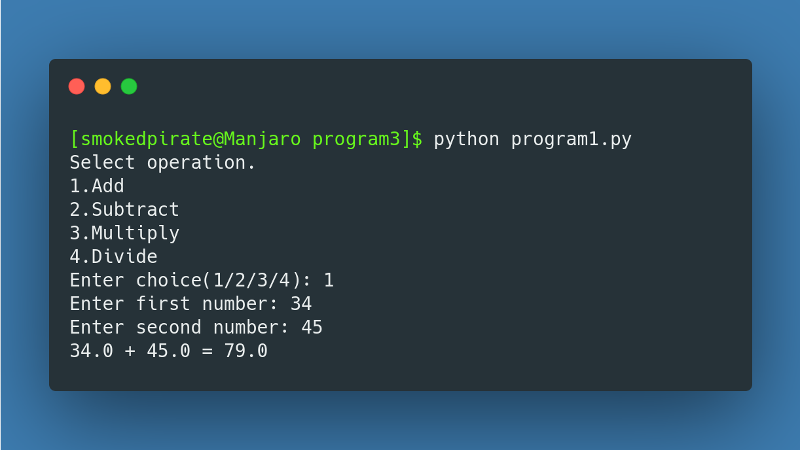


---
### Program 2
#### AIM: To write a random number generator that generates random numbers between 1 and 6 
#### Source code:
``` Python
import random
a = random.randint(1, 6)
print(f"Dice rolls {a}")
```

#### Output: 


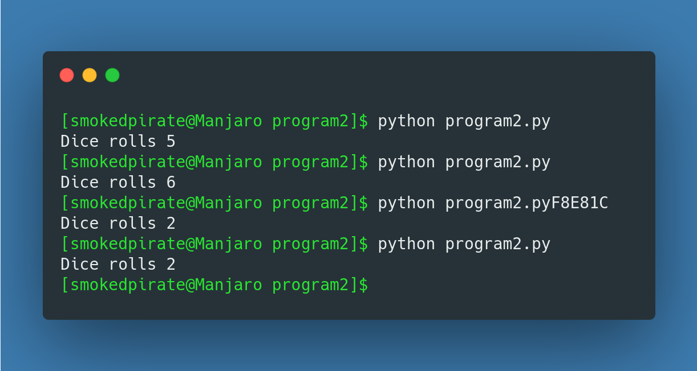

---
### Program 3
#### AIM: To write a Python program to read a text file ( story.txt) line by line and print it.
#### Source code:
``` python
story = "story.txt"
with open(story, "r") as f:
    lines = f.readlines()
    for line in lines:
        print(line)
```

#### Output: 


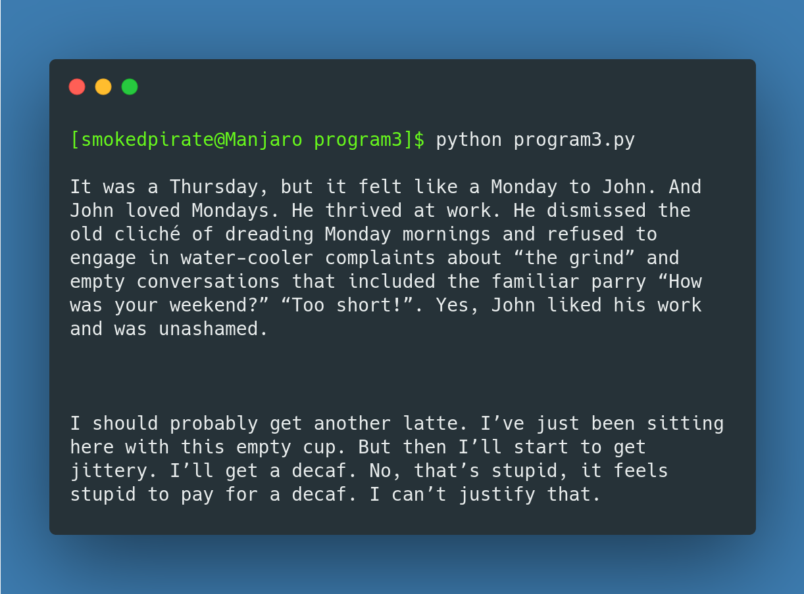


---
### Program 4
#### AIM: To Write a Python program to read a text file and remove all the lines that contains the character ‘a’ in the file and write it in another file
#### Source code:
```python
oldfile = open('content.txt')
lines = oldfile.readlines()
newopen = open('newfile.txt', 'w')
#print(lines)

for line in lines:
    if 'a' in line:
        #print(line)
        line = line.replace(line, '')
    else:
        newopen.write(line)
newopen.close()
oldfile.close()
print("Contents copied over to newfile.txt")
```
#### Output: 


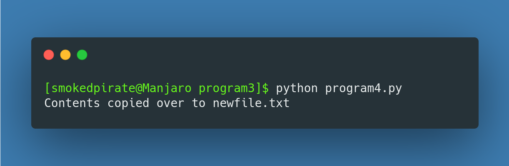


---

### Program 5
#### AIM: To write a Python program to read a text file line by line and display each word seperated by a #.
#### Source code:
```python
with open('story.txt', 'r') as f:
    for line in f:
        for word in line.split():
            print(word, end="#")
    print('\n')
```

#### Output: 

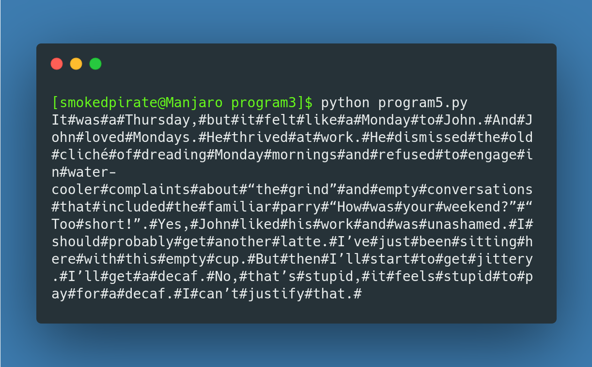


---
### Program 6
#### AIM: To Write a Python program to read a text file line by line and display the number of vowels/ consonants / upper case letters and lower case characters.
#### Source code:
```python
vowels = ['a','e','i','o','u']
vowels_count = 0
consonat_count = 0
upper_count = 0
lower_count = 0


file = open('story.txt', 'r')
data = file.read()
print(data)
for ch in data:
    if str.isupper(ch):
        upper_count += 1
    elif str.islower(ch):
        lower_count += 1
    ch2 = str.lower(ch)
    if ch2 in vowels:
        vowels_count+=1
    elif ch2 not in vowels:
        consonat_count+=1

print(f"No. of vowels are {vowels_count}")
print(f"No. of vowels are {consonat_count}")
print(f"No. of vowels are {upper_count}")
print(f"No. of vowels are {lower_count}")
file.close()
```

#### Output: 

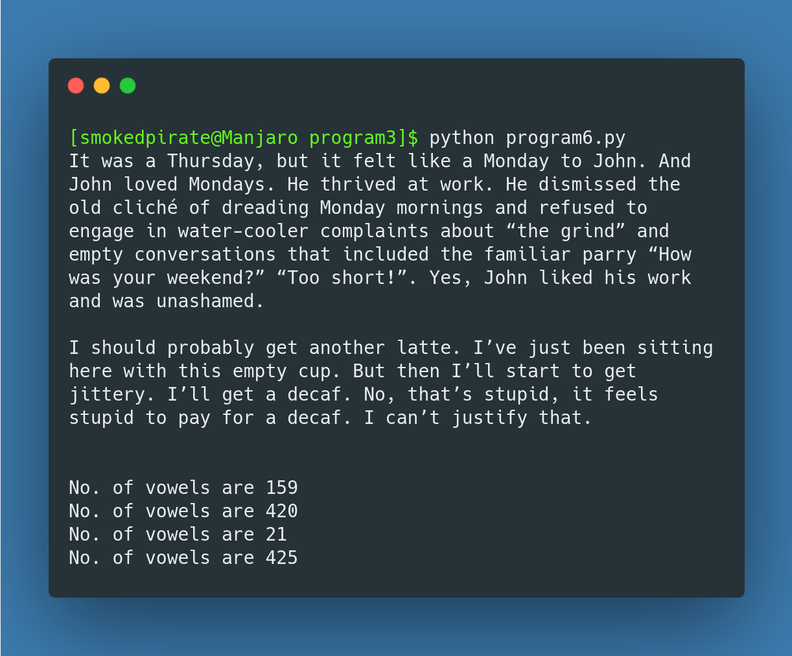


---

### Program 7
#### AIM: To Write a Python program to create a binary file with name and roll number. Search for a given roll number and display the name, if not found , display appropriate message
#### Source code:
```python
import pickle
import sys
import pprint as pp
dict= {}

def write_in_file():
    file = open("Student.pickle", "ab")
    dict["Roll"] = int(input("Enter the Roll NO: "))
    dict["Name"] = input("Enter a name: ")
    pickle.dump(dict, file)
    file.close()

def display():
    file = open("Student.pickle", 'rb')
    try:
        while True:
            Student = pickle.load(file)
            pp.pprint(Student)
    except EOFError:
        pass
    file.close()


def search():
    file = open("Student.pickle", 'rb')
    reader = int(input("Enter the Roll No. to search: "))
    found = False
    try:
        while True:
            data = pickle.load(file)
            if data["Roll"] == reader:
                print("Record Found")
                print(data)
                found = True
                break
    except EOFError:
        pass
    if found==False:
        print("Record not found \n \n")
    file.close()


#main program
while True:
    print("Menu \n 1-Write in a file \n 2-display \n 3-Search \n 4-exit \n")
    ch = int(input("Enter a Choice: "))
    if ch==1:
        write_in_file()
    if ch==2:
        display()
    if ch==3:
        search()
    if ch==4:
        sys.exit()
```
#### Output: 

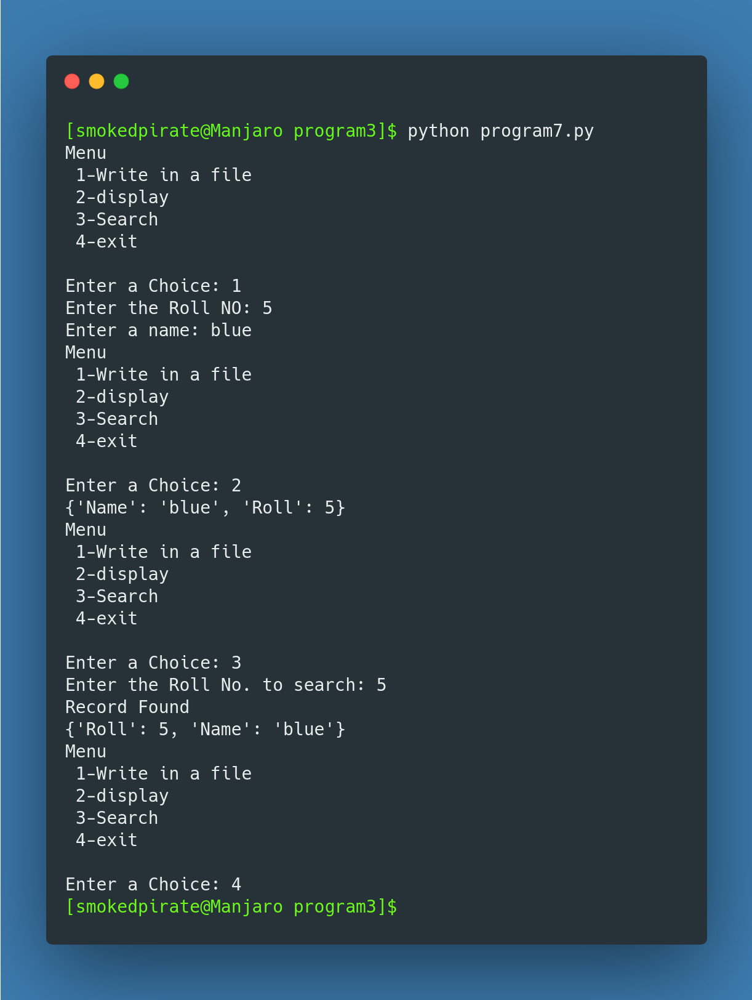


---
### Program 8
#### AIM: To Write a Python program to create a binary file with roll number , name and marks. Input a roll number and update the marks.
#### Source code:
```python
import pickle
import pprint as pp
import sys

def Display(data):
    data = {}
    file = open("Student.pickle", 'rb')
    try:
        while True:
            Student = pickle.load(file)
            pp.pprint(Student)
    except EOFError:
        file.close()

def Search(data):
    data = {}
    file = open("Student.pickle", 'rb+')
    reader = int(input("Enter the Roll No. to search: "))
    found = False
    try:
        while True:
            data = pickle.load(file)
            if data["Roll"] == reader:
                print("Record Found")
                print(data)
                found = True
                break
    except EOFError:
        if found == False:
            print("Record not found \n \n")
        file.close()

def write_in_file(data):
    data = {}
    studs = int(input("Enter no. of students: "))
    file = open("Student.pickle", "rb+")
    for i in range(1,studs+1):
        data["Roll"] = int(input("Enter the Roll NO: "))
        data["Name"] = input("Enter a name: ")
        data["Marks"] = float(input("Enter the marks: "))
        pickle.dump(data, file)
        print(f"{i} Record(s) Entered Sucessfully")
        data={}
        
    file.close()

def Update_marks(data):
    data = {}
    found = False
    reader = int(input("Enter the Roll No. to update: "))
    file = open("Student.pickle", 'rb+')

    try:
        while True:
            pos = file.tell()
            data = pickle.load(file)
            if data["Roll"] == reader:
                print("Record Found")
                print(data)
                data["Marks"] = float(input("Enter the marks: "))
                file.seek(pos)
                found = True
                pickle.dump(data, file)
                break
    except EOFError:
        if found == False:
            print("Record not found \n \n")
        else:
            print("Marks updated Sucessfully")
        file.close()

    
Sdata = {}

#main program
while True:
    print("Menu \n 1-Write in a file \n 2-display \n 3-Search \n 4-Update Marks \n 5-exit")
    ch = int(input("Enter a Choice: "))
    if ch == 1:
        write_in_file(Sdata)
    if ch == 2:
        Display(Sdata)
    if ch == 3:
        Search(Sdata)
    if ch == 4:
        Update_marks(Sdata)
    if ch == 5:
        sys.exit()

```

#### Output: 


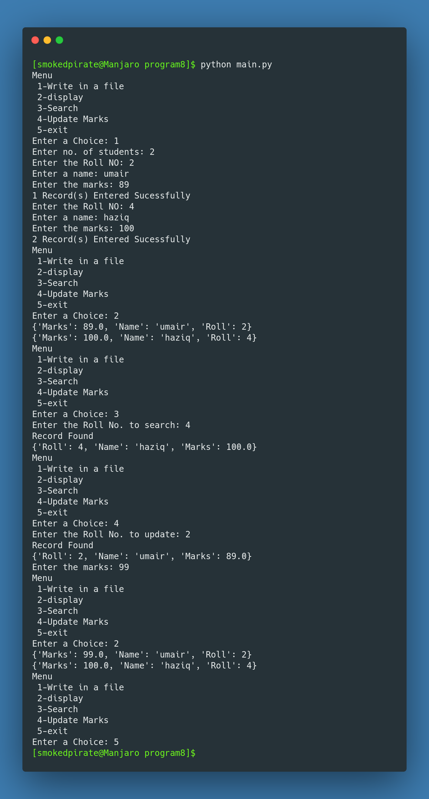


---
### Program 9
#### AIM: To Write a Python program which implements a List using a list data-structure.
#### Source code:
```python
import sys

LIST = []

def add(index,obj):
    LIST.insert(index,obj)


def delete(elememt):
    LIST.remove(elememt)


def search(obj):
    for i in range(len(LIST)):
        if LIST[i] == obj:
            print(f"Object found at {i} index")


while True:
    print('''\n1. Insert a value into the LIST
2. Append a value to the list
3. Delete a value from the LIST
4. Display the LIST
5. Search the LIST for an element 
6. Exit
    ''')
    choice = int(input("Enter a choice: "))


    if choice == 1:
        OBJECT = input("Element: ")
        INDEX = int(input("Index: "))
        add(INDEX,OBJECT)


    elif choice == 2:
        VAR = input("Element to append: ")
        LIST.append(VAR)


    elif choice == 3:
        ELEMENT = input("Enter the element to remove: ")
        try:
            delete(ELEMENT)
        except ValueError:
            print("ELement not present in the list")


    elif choice == 4:
        print(LIST)


    elif choice == 5:
        OBJ = input("Enter the element to search: ")
        search(OBJ)


    elif choice == 6:
        sys.exit()
```

#### Output: 


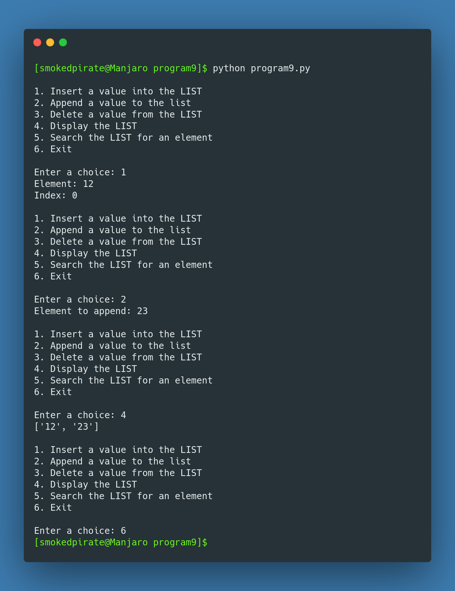


---
### Program 10
#### AIM: To write a Python program to implement a stack using a list data-structure.
#### Source code:
```python
import sys

STACK = []

def push(element):
    STACK.append(element)

def pop():
    if len(STACK) == 0:
        print("List is empty")
    else:
        c = STACK.pop()
        print(c)


def display_stack():
    for i in range(len(STACK)-1, -1, -1):
        print(STACK[i])

while True:
    print('''\n1. Push into the STACK
2. Pop value from the STACK
3. Display the STACK
4. Exit
    ''')
    choice = int(input("Enter a choice: "))
    if choice==1:
        val = input("Enter a value: ")
        push(val)
    elif choice==2:
        pop()
    elif choice==3:
        display_stack()
    elif choice == 4:
        sys.exit()
```

#### Output: 


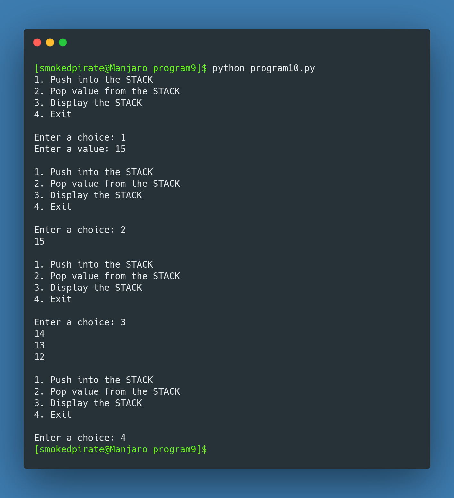

---
### Program 11
#### AIM: To Integrate SQL with Python by importing the MySQL module
#### Source code:
```python
import mysql.connector as sqltor
from mysql.connector import Error

connection = sqltor.connect(
    host='localhost', database='Haziq', user='root', password='<pass>')
try:
    if connection.is_connected():
        db_Info = connection.get_server_info()
        print("Connected to MySQL Server version ", db_Info)
        cursor = connection.cursor()
        cursor.execute("select database();")
        record = cursor.fetchone()
        print("You're connected to database: ", record)

except Error as e:
    print("Error while connecting to MySQL", e)
finally:
    if (connection.is_connected()):
        cursor.close()
        connection.close()
        print("MySQL connection is closed")
```

#### Output: 

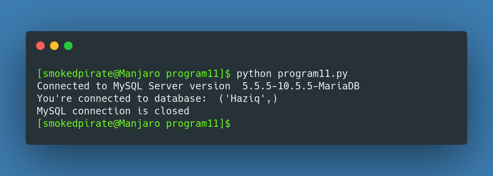

---
### Program 12
#### AIM: To write a Python program to find the most commonly occuring words in a text file or from sample of ten phising emails.
#### Source code:
```python
with open("email.txt", "r") as f:
    content = f.read()
    max = 0
    max_occuring_word = ""
    occurances_dict = {}
    words = content.split()
    for word in words:
        count = content.count(word)
        occurances_dict.update({word:count})
        if count>max:
            max=count
            max_occuring_word = word
    print(f"Most occuring word: {max_occuring_word}")
    print(f"Frequency of other words {occurances_dict}")
```

#### Output: 

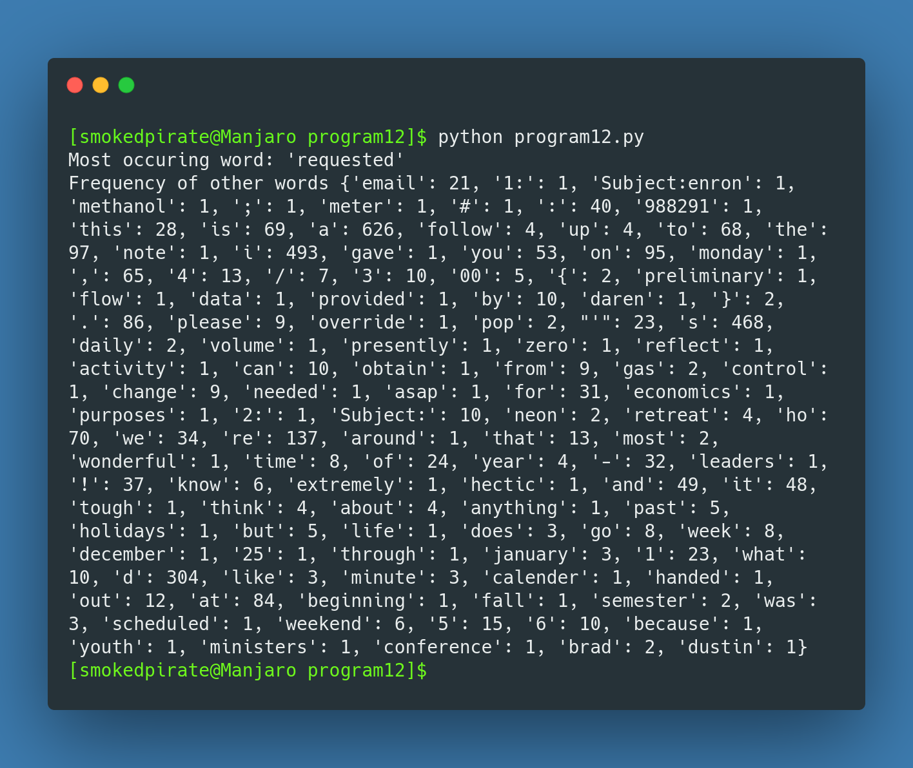

---

<h1 align="center">SQL</h1>
<br/>

#### Q. Consider the following tables GAMES and PLAYER. Write SQL commands for the statements (i) to (iv) and give outputs for SQL queries (v) to (viii)

<br/>

<table style="width:90%">
    <tr>
        <th>GCode</th>
        <th>GameName</th>
        <th>Number</th>
        <th>PrizeMoney</th>
        <th>Date</th>
    </tr>
    <tr>
        <th>101</th>
        <th>CaromBoard</th>
        <th>2</th>
        <th>5000</th>
        <th>23-jan-2004</th>
    </tr>
    <tr>
        <th>102</th>
        <th>Badminton</th>
        <th>2</th>
        <th>12000</th>
        <th>12-dec-2003</th>
    </tr>
    <tr>
        <th>103</th>
        <th>TableTennis</th>
        <th>4</th>
        <th>8000</th>
        <th>14-feb-2004</th>
    </tr>
    <tr>
        <th>104</th>
        <th>Chess</th>
        <th>2</th>
        <th>9000</th>
        <th>01-jan-2004</th>
    </tr>
    <tr>
        <th>105</th>
        <th>LawnTennis</th>
        <th>4</th>
        <th>25000</th>
        <th>19-mar-2004</th>
    </tr>
</table>

<br/>

<table>
    <tr>
        <th>PCode</th>
        <th>Name</th>
        <th>GCode</th>
    </tr>
        <tr>
        <th>1</th>
        <th>Arjun</th>
        <th>101</th>
    </tr>
        <tr>
        <th>2</th>
        <th>Ravi</th>
        <th>105</th>
    </tr>
        <tr>
        <th>3</th>
        <th>Jignesh</th>
        <th>101</th>
    </tr>
        <tr>
        <th>4</th>
        <th>Nihir</th>
        <th>103</th>
    </tr>
        <tr>
        <th>5</th>
        <th>Sohil</th>
        <th>104</th>
    </tr>
</table>

<br/>
(i)    To display the name of players who playsCaromBoard.
(ii)   To display details of those game which are having PrizeMoney morethan 8000.
(iii)  To display the details of those games whose name starts from character ‘B’.
(iv)   To display the details of those games which start after 01-jan-2004.

<br/>

(v)    Select COUNT(DISTINCT number) from games;
(vi)   Select MAX(date), MIN(date) from games;
(vii)  Select AVG(PrizeMoney) from games Group by Number Having count(GCode)>2;
(viii) Select GameName from games Where date BETWEEN ’10-Jan-2004’ AND ’20-Feb-2004’;


